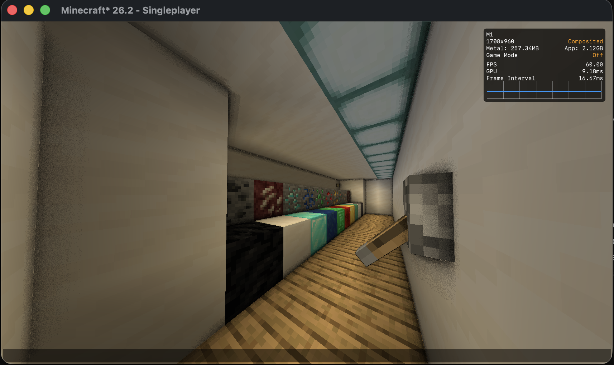
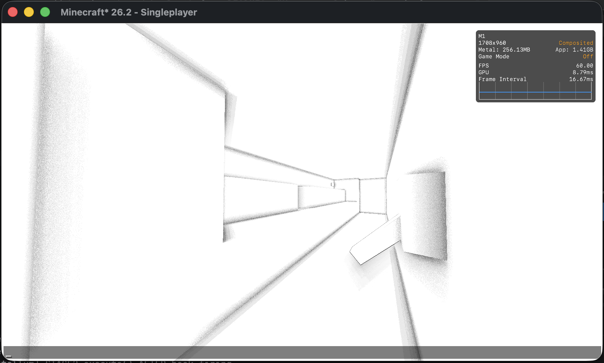
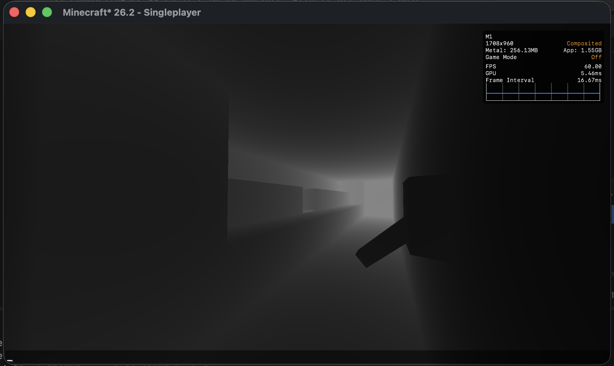
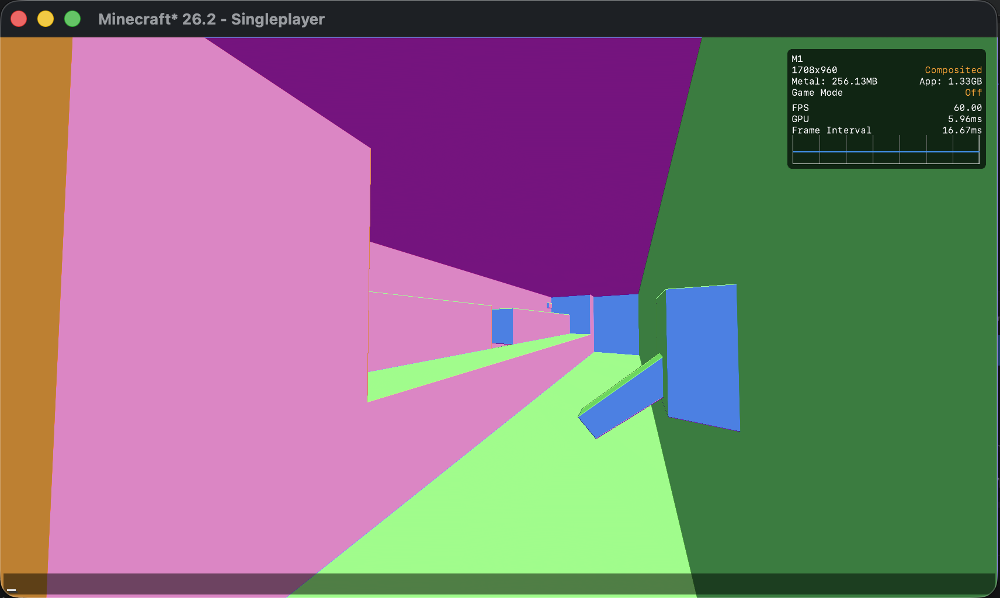

## Retina S v0.0.1
### (S = Shaders)
Retina S is an experimental rendering backend for Minecraft on macOS that uses Apple’s Metal API instead of OpenGL/Vulkan. It provides a more native rendering path and aims to improve performance and efficiency on Apple Silicon. Fork of Metallum by Kokodio, and of my own metallum-bleedingedge (old fork that I used to ship early features in it lol)

This project is still experimental. Performance, stability, and compatibility may vary depending on your system and installed mods. If you encounter bugs, please report them on GitHub.

Compatible with Sodium.

(still) vibecoded as hell

## Roadmap
Right now Retina S lives as a fork on top of Metallum. Long-term goal is to split off into its own standalone mod compatible with Metallum — same relationship Iris has to Sodium — instead of staying glued to whichever Metallum snapshot it was forked from. Metallum moves fast enough that pinning to one version now means being "the old one" within a few months/weeks; decoupling means Retina S can keep up on its own terms instead of dragging a fork along every time upstream changes.

## Changes from Metallum
1. ShaderLoader (intial shader support and more)
2. Same functions from metallum-bleeding edge
3. Deferred GBuffer pass (opaque terrain redirected off-screen, composited back before translucent/entities draw) — currently used for Real SSAO and debug views.
4. Full-scene composite hook, firing after translucent terrain + entities + outline finish drawing — currently runs a debug_depth pass over the whole frame (water, mobs, block outline all included), proving the pipeline end-to-end. Real post-process (fog, etc) goes here next.

## Current status
GBuffer + composite pipeline is stable, no known crashes. Two composite stages exist:
- opaque-only (debug_depth) — used today
- full-scene (post translucent/entities/outline) — currently swapped to a depth-reconstructed normal debug view (`debug_normal`) while normals are being validated; was debug_depth_full before that, swap back in `CompositePass#runFull` if needed

No real geometric normal G-buffer (MRT on the terrain draw) yet — `debug_normal` reconstructs an approximate view-space normal purely from the depth buffer (screen-space derivatives of unprojected view-space position), as a cheap way to validate the math before committing to a real MRT rewrite. Expect noise on silhouette edges (block/mob outlines against sky) — that's the known limitation of this technique, not a bug. Flat faces and hard edges (block corners) read cleanly.

Both stages need their own mixin: the opaque stage hooks Sodium's `drawChunkLayer` directly (the only place that sees the right OPAQUE/TRANSLUCENT timing with Sodium installed), while the full-scene stage hooks `LevelRenderer#render`'s `FrameGraphBuilder#execute` call directly (the only place that sees the whole frame — Sodium never touches entities/outline/clouds, so it can't own this stage). Both are registered in `metallum.mixins.json`'s `client` list — if a mixin class exists but isn't listed there, it silently never applies, no error, no crash, just nothing happening. Learned that one the hard way.

Shadow map, bloom, and fog were pulled out and haven't been rebuilt yet.

### Performance
- **SSAO:** Currently runs at around ~53-60 FPS at high resolutions (e.g., 3360x2170, near 4K).
- **Normal Debug:** The previous performance drops with `debug_normal` have been resolved. It now runs smoothly without performance issues, even at high resolutions like 3360x2170.

## Screenshots

### 1. Real SSAO (Ambient Occlusion)
The final scene rendered with contact shadows (SSAO) applied over opaque geometry.

### 2. SSAO Debug View
Isolated visualization of the computed occlusion term, without scene colors.

### 3. Depth Buffer Debug
Linearized view of the depth buffer used for view-space position reconstruction.

### 4. Normal Buffer Debug
Visualization of normals mathematically reconstructed from depth (no real G-Buffer MRT yet).

x   
## Requirements
- macOS
- Apple Silicon (M1 or newer)