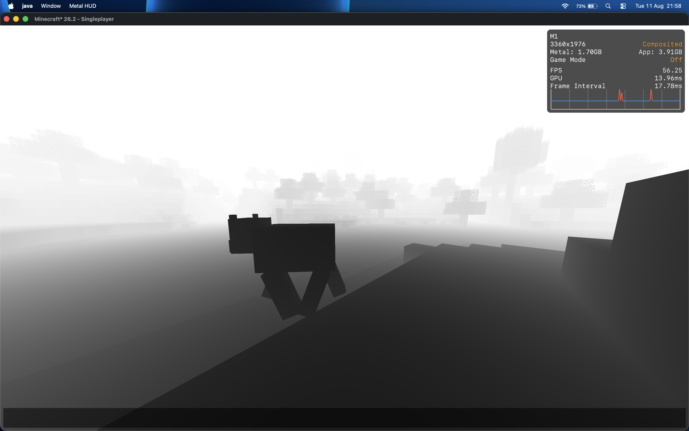

## Retina S
### (S = Shaders)
Retina S is an experimental rendering backend for Minecraft on macOS that uses Apple’s Metal API instead of OpenGL/Vulkan. It provides a more native rendering path and aims to improve performance and efficiency on Apple Silicon. Fork of Metallum by Kokodio, and of my own metallum-bleedingedge (old fork that I used to ship early features in it lol)

This project is still experimental. Performance, stability, and compatibility may vary depending on your system and installed mods. If you encounter bugs, please report them on GitHub.

Compatible with Sodium.

(still) vibecoded as hell

## Roadmap
Right now Retina S lives as a fork on top of Metallum. Long-term goal is to split off into its own standalone mod compatible with Metallum — same relationship Iris has to Sodium — instead of staying glued to whichever Metallum snapshot it was forked from. Metallum moves fast enough that pinning to one version now means being "the old one" within a few months/weeks; decoupling means Retina S can keep up on its own terms instead of dragging a fork along every time upstream changes.

## Changes from Metallum
1. ShaderLoader (intial shader support and more)
2. Same functions from metallum-bleeding edge
3. Deferred GBuffer pass (opaque terrain redirected off-screen, composited back before translucent/entities draw) — currently only used for a debug_depth view
4. Full-scene composite hook, firing after translucent terrain + entities + outline finish drawing — currently runs a debug_depth pass over the whole frame (water, mobs, block outline all included), proving the pipeline end-to-end. Real post-process (fog, etc) goes here next.

## Current status
GBuffer + composite pipeline is stable, no known crashes. Two composite stages exist:
- opaque-only (debug_depth) — used today
- full-scene (post translucent/entities/outline, debug_depth) — used today too, confirmed working with Sodium

Both stages need their own mixin: the opaque stage hooks Sodium's `drawChunkLayer` directly (the only place that sees the right OPAQUE/TRANSLUCENT timing with Sodium installed), while the full-scene stage hooks `LevelRenderer#render`'s `FrameGraphBuilder#execute` call directly (the only place that sees the whole frame — Sodium never touches entities/outline/clouds, so it can't own this stage). Both are registered in `metallum.mixins.json`'s `client` list — if a mixin class exists but isn't listed there, it silently never applies, no error, no crash, just nothing happening. Learned that one the hard way.

Shadow map, bloom, and fog were pulled out and haven't been rebuilt yet.

## Requirements
- macOS
- Apple Silicon (M1 or newer)