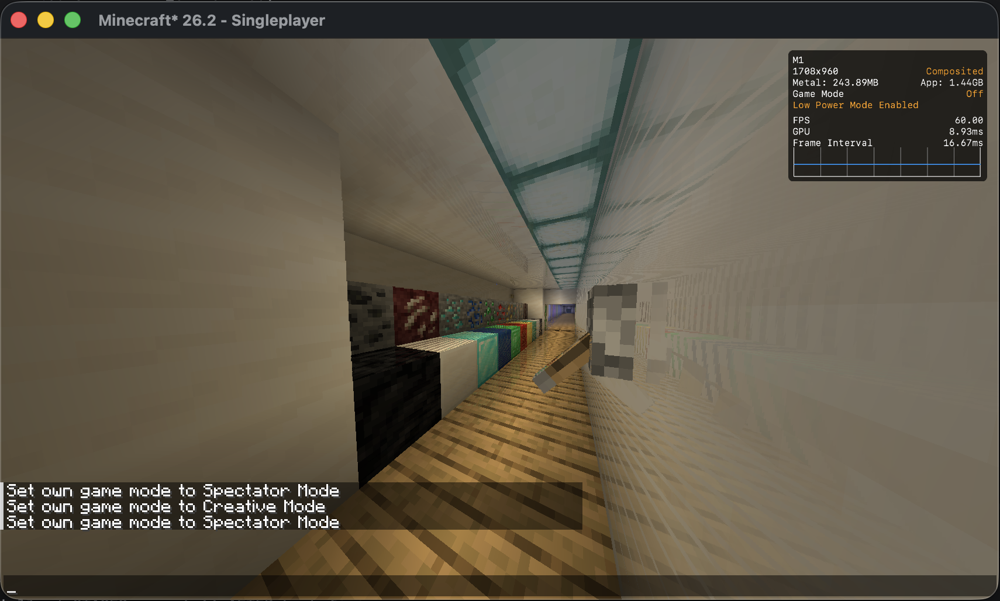

## Retina

Retina is an experimental post-processing framework for Minecraft on macOS that uses Apple’s Metal API instead of OpenGL/Vulkan. It provides a more native rendering path and aims to improve performance and efficiency on Apple Silicon.

This project is still experimental. Performance, stability, and compatibility may vary depending on your system and installed mods. If you encounter bugs, please report them on GitHub.

Compatible with Sodium.

## Screenshots

### 1. Real SSAO (Ambient Occlusion)
The final scene rendered with contact shadows (SSAO) applied over opaque geometry.

### 2. SSAO Debug View
Isolated visualization of the computed occlusion term, without scene colors.

### 3. Depth Buffer Debug
Linearized view of the depth buffer used for view-space position reconstruction.

### 4. Normal Buffer Debug
Visualization of normals mathematically reconstructed from depth.

### 5. SSR (Screen-Space Reflections)
Reflective surfaces rendered using screen-space raymarching.

### 6. SSR + SSAO Combined
Screen-space reflections composited together with ambient occlusion.

## Requirements
- macOS
- Apple Silicon (M1 or newer)
- 8GB RAM Minimum (Obviously..)